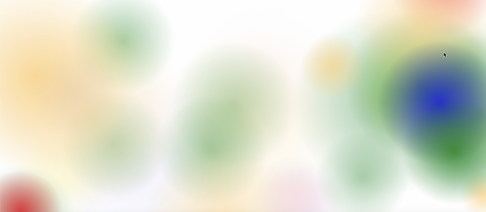

# Eighty Eight: Svelte Mic Visualizer

A real-time audio visualiser built with **Svelte**, using the microphone to detect pitch and display colour-coded, animated circles.

---

## Features

- Live pitch detection via [Pitchy](https://github.com/peterkhayes/pitchy)
- Canvas-based circle visualisations
- Notes mapped to specific colours (colours I grew up learning the piano to)
- Lightened colours for sharps/flats
- Smooth animations that react to volume

---

## Tech

- Svelte
- Web Audio API
- HTML5 Canvas
- Pitchy (pitch detection)

---

## 📸 Preview




---

## Setup

```bash
git clone https://github.com/your-username/eighty-eight.git
cd eighty-eight
npm install
npm run dev
